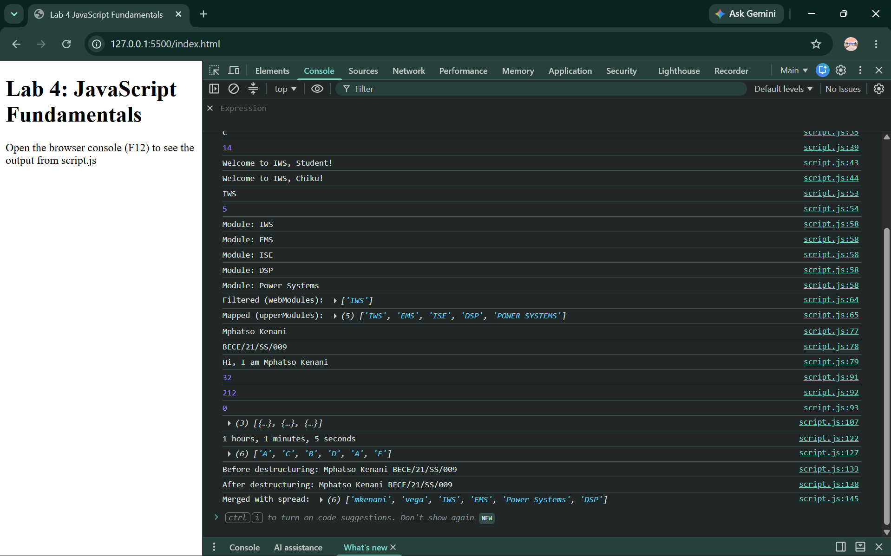

# Lab 4 —JavaScript Fundamentals
 
**Name:** Mphatso Kenani
**Student ID:** BECE/21/SS/009
 
## Overview
Covers variables (`let`/`const`), functions (declaration, arrow, default parameters),
arrays and objects (`forEach`, `.filter()`, `.map()`), all four practice tasks
(temperature converter, student score filter, seconds formatter, grade mapper),
and the extension challenge (destructuring + spread operator).
 
Opened `index.html` in a browser and checked the Console (F12) for all output.
 
## Screenshot
